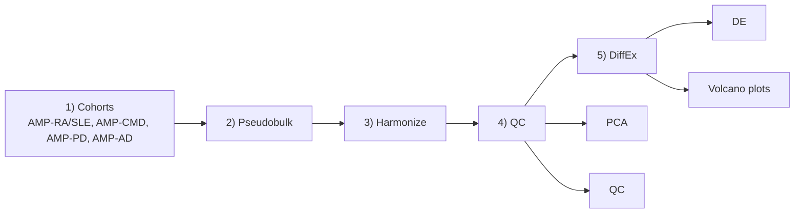

# SysBIO FAIRplex Single Cell (GitHub Ready)

Clean folder layout with:

- main DiffEx pipeline runner: `run_diffex_pipeline.py`
- helper functions: `helpers/diffex_helpers.py`
- exploratory scripts: `EDA/`
- diagram assets: `diagram/`

## Pipeline map (Mermaid)



## DiffEx policy

The main script uses `case_control` and currently allows:

- `CASE vs CONTROL`
- `CASE vs CASE`

This behavior is configured in `run_diffex_pipeline.py`:

- `ALLOW_CASE_CONTROL = True`
- `ALLOW_CASE_CASE = True`

## Run DiffEx

From repository root:

```bash
python3 single_Cell/run_diffex_pipeline.py
```

## Run EDA PCA example

```bash
python3 single_Cell/EDA/pca_from_counts.py
```

## Diagram source

- Metro map definition: `diagram/sysbio_fairplex_pipeline.mmd`
- To render SVG:

```bash
nf-metro render single_Cell/diagram/sysbio_fairplex_pipeline.mmd -o single_Cell/diagram/sysbio_fairplex_pipeline.svg --theme light
```

