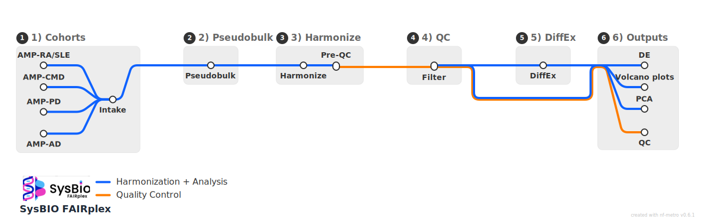

# SysBIO FAIRplex Single Cell

Clean folder layout with:

- main DiffEx pipeline runner: `run_diffex_pipeline.py`
- helper functions: `helpers/diffex_helpers.py`
- exploratory scripts: `EDA/`
- diagram assets: `diagram/`


## Pipeline map (Rendered nf-metro SVG)



## DiffEx policy

Pipeline configurable in `run_diffex_pipeline.py`:

## Run DiffEx

From repository root:

```bash
python3 single_Cell/run_diffex_pipeline.py
```

## Run EDA PCA example

```bash
python3 single_Cell/EDA/pca_from_counts.py
```

## Diagram source
    Diagram is built using nf-metro. 
